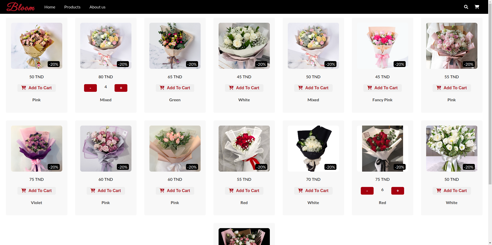

# Flower-Shop

**Flower-Shop** is an e-commerce app that lets users order flowers online. Features include browsing flowers, adding them to the cart, and receiving an email confirmation after placing an order with the total amount. The app is split into two parts: **frontend** (React) and **backend** (Node.js/Express with MongoDB).

## Screenshot


## Features
- Browse a variety of flowers.
- Add flowers to the cart and proceed to checkout.
- Receive an email confirmation after order placement, which includes the total order amount.

## Folder Structure

The project is organized into two main folders:
- `frontend/`: Contains the React app responsible for the user interface.
- `backend/`: Contains the Node.js/Express server with MongoDB for storing order details and sending confirmation emails.

---

## **Frontend Setup** (React)

### Installation

1. Navigate to the `frontend` folder:

   ```bash
   cd frontend

2. Install the necessary dependencies:

   ```bash
   npm install

3. Install the necessary dependencies:

   ```bash
   npm start

This will start the app on http://localhost:3000. You can open this URL in your browser to interact with the flower shop.

### Backend Setup

1. Navigate to the `backend` folder:

   ```bash
   cd backend

2. Install the necessary dependencies:

   ```bash
   npm install

3. Create a .env file in the backend folder and add your EmailJS credentials (for sending order confirmation emails):

   ```bash
    EMAILJS_SERVICE_ID=your_service_id
    EMAILJS_TEMPLATE_ID=your_template_id
    EMAILJS_USER_ID=your_user_id
    MONGO_URI=your_mongo_database_connection_string

Replace `your_service_id`, `your_template_id`, `your_user_id`, and `your_mongo_database_connection_string` with your actual credentials.

4. Running the Backend:

   ```bash
   npm run dev

The backend server will start on http://localhost:5000. This will handle API requests and email sending.
